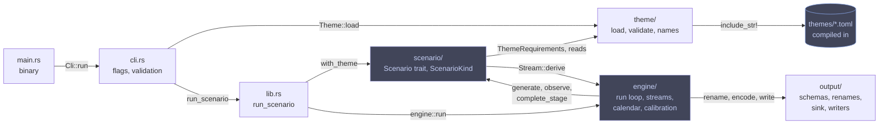
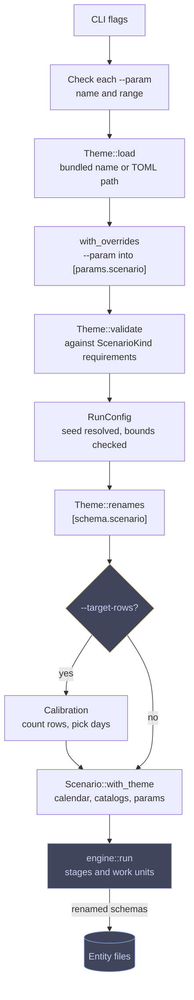
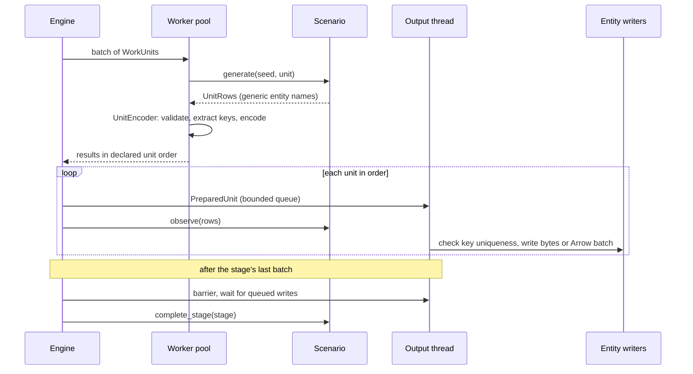
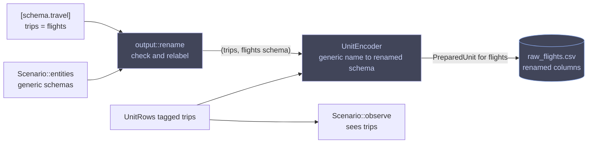

# Architecture

Rowing Machine is one Cargo package: a library (`src/lib.rs`) that holds everything testable and a thin binary (`src/main.rs`) that parses flags, calls the library, and prints any error before exiting with status 1. [Scenarios and themes](scenarios/README.md) covers what each scenario simulates; this page covers how a run flows through the modules.

## Module map



The theme module never imports a scenario, and the output module never branches on scenario or theme.

```text
src/
  main.rs              binary: parse the CLI, run, print errors
  lib.rs               module tree and run_scenario, the library entrypoint
  cli.rs               clap definitions, flag validation, help text
  engine/
    mod.rs             RunConfig and the run loop: stages, batches, worker pool
    stream.rs          seed derivation and PCG streams
    calendar.rs        day state: curves, seasons, weekday, hours
    calibration.rs     row-count sampling and the --target-rows duration search
  output/
    mod.rs             EntitySchema, Value, Row, Renames, UnitEncoder, OutputSink, EntityWriter
    ordered.rs         the output thread and its bounded queue
    csv.rs             CSV writer
    jsonl.rs           JSONL writer, optionally gzip-compressed
    parquet.rs         Parquet writer, optionally zstd-compressed
  theme/
    mod.rs             Theme, requirements, bundled registry, path loading, validation
    names.rs           format expansion and weighted without-replacement assignment
  scenario/
    mod.rs             Scenario trait, WorkUnit, ScenarioKind registry
    ecommerce/         stores, personas, catalog, orders, tweets, loyalty tiers
    saas/              marketing, funnel, sales, account lifecycle, usage
    travel/            network, schedules, operations, bookings, loyalty tiers
themes/                bundled theme TOML: plain, fantasy_rpg, sneakers, airline
tests/                 integration tests that drive the binary and read its files
benches/               throughput benchmarks
```

## Run pipeline



- The default theme comes from `ScenarioKind::default_theme`: `airline` for travel, `plain` otherwise.
- `run_scenario` validates the theme again, so library callers get the same checks as the CLI.
- Calibration counts rows under the scenario's generic entity names and writes no files.

## Engine loop

`engine::run` renames the scenario's schemas, opens the output sink, and walks the work units stage by stage. Each stage runs in batches; this is one batch:



| Setting | One worker | N workers |
| --- | --- | --- |
| Generation | Serial on the engine thread | Rayon pool of N threads |
| Batch size | 1 unit | 4 × N units |
| Output queue capacity | 1 unit | 4 × N units |

- Results are collected by index, so declared unit order holds even when units finish out of order.
- The output thread is the only thread that touches files: buffering, gzip, Parquet row groups, and duplicate-key checks happen there, so worker scheduling cannot change the bytes.
- Generation errors surface in declared unit order. A write error stops the queue, prevents stage completion, and is reported after the engine joins the output thread.
- Payload memory depends on batch size and unit volume, not run length. Primary keys are retained for the whole run (UUID keys as `u128`, composite keys as typed values), so that memory grows with row count.

## Stages by scenario

Units are ordered by `(stage, indices)`, and the engine rejects a scenario whose units are out of order or repeated.

| Scenario | Stage | Work unit | Emits | Stage completion |
| --- | --- | --- | --- | --- |
| ecommerce | 0 | One unit | stores, products, supplies | — |
| ecommerce | 1 | Day × store | orders, items | Rank customers into loyalty tiers from observed order counts; assign name indices |
| ecommerce | 2 | Day × store | tweets (regenerates order decisions from the same streams) | — |
| ecommerce | 3 | Store | customers who ordered | — |
| saas | 0 | Day | campaigns, ad_spend, touches | Admit touched demo requests to reps with capacity |
| saas | 1 | Day | plans and sales_reps (day 0), leads, accounts, opportunities, opportunity_stages, sales_activities | Fix each account's user-name offset from a lifecycle count pass |
| saas | 2 | Account | users, subscriptions, mrr_movements, invoices, sessions, events | — |
| travel | 0 | One unit | locations, routes, vehicles, add_ons | — |
| travel | 1 | Day × base | trips, bookings, tickets, ticket_add_ons | Rank travellers into loyalty tiers from observed booking counts; assign name indices |
| travel | 2 | Base | travellers who booked | — |

Regenerating tweets in stage 2 trades CPU for not holding every order in memory. The scenario references explain the rules behind each stage: [ecommerce](scenarios/ecommerce.md), [saas](scenarios/saas.md), [travel](scenarios/travel.md).

## Themes relabel at the output boundary

Scenarios declare and emit generic entity names (`trips`, `travellers`). A theme's `[schema.<scenario>]` renames are applied once, when the engine builds the sink, so simulation, observation, and calibration never see themed names.



`output::rename` rejects unknown tables or `entity.column` keys, names that are not lowercase identifiers, and duplicates, and it relabels primary-key columns along with their columns. [Themes](themes/README.md#table-and-column-names) covers the file syntax.

## Contracts between modules

| Contract | Owner | Rule |
| --- | --- | --- |
| Streams | `engine::stream` | `Stream::derive(seed, name, indices)` returns a `Pcg64Mcg` seeded by mixing all three with SplitMix64. Every simulation draw goes through a named stream; no stream is held across work units. Only the CLI uses system entropy, to pick a seed for `--seed 0`. |
| Scenario | `scenario::Scenario` | Declares `entities()` and ordered `units()`. `generate(seed, unit)` is a pure function of its inputs. `observe` accumulates cross-unit facts in declared order, and `complete_stage` fixes them before the next stage. A scenario knows nothing about threads, formats, or renames. |
| Scenario registry | `scenario::ScenarioKind` | Maps CLI names to theme requirements and the default theme. |
| Schemas and rows | `output` | `EntitySchema` holds the name, ordered typed columns with nullability, and the primary key. Rows are `Vec<Value>` in schema order; money is `Value::Cents`. |
| Encoding | `output::UnitEncoder` | Runs on workers: checks row width, types, nullability, UUID version bits, and date ranges, extracts primary keys, and encodes CSV/JSONL bytes or an Arrow batch. |
| Writers | `output::EntityWriter` | Appends bytes or Arrow batches and finishes the file. Writers never branch on scenario or theme. Files open on an entity's first row, so an empty entity writes no file. |
| Themes | `theme::Theme` | Data only: name generators, label sets, typed catalogs, `[params.<scenario>]`, and `[schema.<scenario>]` renames. A scenario's `ThemeRequirements` lists the name kinds, label set lengths, catalogs, and parameters (default and range) it reads; a theme is compatible when it covers them. Schemas come from scenarios, never themes. |
| Calibration | `engine::calibration` | `calibrate(factory, seed, entity, target, max_days)` builds a fresh scenario per sample and counts rows through the same generate, observe, and complete-stage sequence. |

Keep a scenario's requirements to what its simulation reads; every declared slot is something each theme must supply.

## Output details

- Parquet sizes row groups from an estimate: the first nonempty unit's row count times the units left in that stage, divided by 8 and clamped to 1,024–65,536 rows. The estimate affects buffering only.
- Gzip headers carry a zero modification time and no filename, so compressed bytes are reproducible.
- [The output schema](output-schema.md) lists every file, column, and type encoding.

## Calibration

`--target-rows` searches for a run length whose calibration entity lands within 5% of the target, or the nearest whole day when no duration does.

| Scenario | Calibration entity |
| --- | --- |
| ecommerce | orders |
| saas | accounts |
| travel | tickets |

The search starts with a 30-day sample, grows the duration until it brackets the target, then interpolates inside the bracket. It stays within the calendar's last supported date and prints `Calibrating <entity> for --target-rows <n>...` to stderr unless `--quiet` is set.

## Dependencies

Keep the list short; a new crate needs a job no existing one does.

| Need | Crate |
| --- | --- |
| Errors, CLI | `anyhow`, `clap` |
| PCG streams, distributions | `rand`, `rand_core`, `rand_pcg`, `rand_distr` |
| Dates and times | `jiff` |
| CSV | `csv` |
| JSONL, theme files | `serde`, `serde_json`, `toml` |
| Parquet | `arrow`, `parquet` (zstd feature) |
| Gzip | `flate2` |
| Worker pool | `rayon` |
| Progress | `indicatif` |
| Tests and benchmarks | `assert_cmd`, `tempfile`, `criterion` (dev) |
