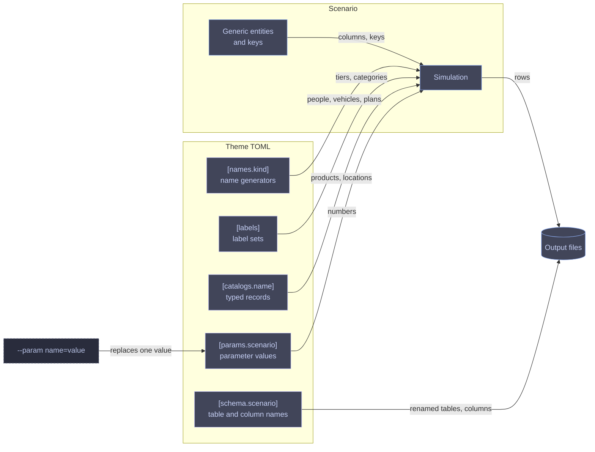

# Scenarios and themes

A **scenario** is the skeleton of a simulated business: generic entities (people, places, products, posts, trips), the keys between them, and the parameters that drive the simulation. A **theme** is the skin: it names the tables and columns, generates names, supplies label sets and catalogs, and sets parameter values. Swapping themes changes what the data is called and, through catalogs and parameters, how much of it there is; it never changes which tables exist or how they join.



A scenario declares every slot it reads: name kinds, label sets with exact lengths, catalogs with typed fields and a minimum length, and parameters with a default and range. A theme works with a scenario when it fills every slot; the run fails before simulation otherwise. [Theme authoring](../themes.md) covers the file format.

## Scenarios

| Scenario | Simulates | Work unit | Default theme | Reference |
| --- | --- | --- | --- | --- |
| `ecommerce` | Six stores selling 15 products to customer pools that grow as each store opens | One store-day | `plain` | [ecommerce](ecommerce.md) |
| `saas` | A B2B software company: marketing, a sales pipeline, trials, seat subscriptions, invoices, and product usage | One marketing day, then one account | `plain` | [saas](saas.md) |
| `travel` | A transport network: locations, routes, vehicles, scheduled trips, and the bookings and tickets travellers buy | One base-day | `airline` | [travel](travel.md) |

[The output schema](../output-schema.md) lists every column in every entity.

## Bundled themes

| Theme | Scenarios | Skin | Renames | Parameters |
| --- | --- | --- | --- | --- |
| `plain` | ecommerce, saas | Neutral shop and software vocabulary | None | Defaults |
| `fantasy_rpg` | ecommerce | The Arcanum Collective mage guild | 1 table, 5 columns | Defaults |
| `sneakers` | ecommerce | Starcloud Sneakers, a running shoe brand with six flagships | None | `purchase_rate = 0.02` |
| `airline` | travel | SuperAir, a low-cost airline with six UK bases | 4 tables, 10 columns | Defaults |

`rowing-machine themes` prints this list from the binary. Each scenario reference shows its bundled themes' renames and label values side by side.

## Slots each scenario declares

| Scenario | Name kinds | Label sets | Catalogs | Parameters |
| --- | --- | --- | --- | --- |
| `ecommerce` | `person` | 12 | `products`, `supplies` | `price_scale`, `purchase_rate` |
| `saas` | `person`, `organization`, `plan`, `feature`, `campaign` | 4 | None | None |
| `travel` | `person`, `vehicle` | 2 | `locations`, `vehicle_types`, `add_ons`, `fare_classes`, `channels` | 18 |

## Run controls shared by every scenario

| Flag | Default | Effect |
| --- | --- | --- |
| `--seed` | `0` (pick and print one) | Same seed and flags give byte-identical files |
| `--years` | `4` | Run length in 365-day years |
| `--start-date` | `2023-01-01` | Day index 0 |
| `--scale` | `100` | Multiplies each scenario's population: customers, visitors, or travellers |
| `--target-rows` | Unset | Picks the run length that yields about this many orders, accounts, or tickets |
| `--theme` | Per scenario | Bundled name or a TOML path |
| `--param` | Theme values | `name=value`, repeatable |

Every money column is integer cents, and every timestamp is UTC.

```bash
rowing-machine --scenario ecommerce --theme fantasy_rpg --seed 42
rowing-machine --scenario saas --seed 42 --years 2 --scale 50
rowing-machine --scenario travel --seed 42 --param daily_frequency=3 --param route_density=0.2
```
