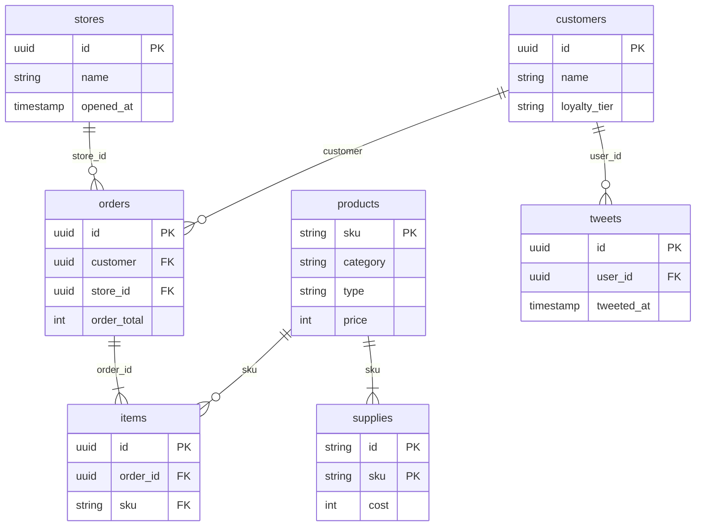

# Ecommerce scenario

`--scenario ecommerce` simulates a shop with six stores that open over the run. Each store has its own customer pool; customers order products during store hours, some post a short message about their order, and ordering customers earn one of four loyalty tiers. It is the upstream data for Queria, so [`fantasy_rpg`](../themes/fantasy_rpg.md) renders it as the Arcanum Collective. Code lives in [`src/scenario/ecommerce/`](../../src/scenario/ecommerce/).

## Entities



Diagrams show keys and the columns that carry the model; [the output schema](../output-schema.md#stores) lists every column. A tweet carries its author but no order ID; it is posted 0–19 minutes after one of that customer's orders.

## Volume

A default run (`--seed 42`, four years from 2023-01-01, `--scale 100`) writes:

| Entity | `plain` and `fantasy_rpg` | `sneakers` |
| --- | --- | --- |
| `stores` | 6 | 6 |
| `products` | 15 | 15 |
| `supplies` | 92 | 92 |
| `customers` | 6,120 | 4,987 |
| `orders` | 1,547,265 | 34,523 |
| `items` | 2,060,194 | 44,800 |
| `tweets` | 544,502 | 11,577 |

Other seeds land within a few percent. Volume grows linearly with `--scale` and with run length (faster later, through the growth curve). [`sneakers`](../themes/sneakers.md#parameters) sets `purchase_rate = 0.02`, which is why its counts are about 2% of `plain`'s. `--target-rows` calibrates on orders.

## What drives orders

### Stores and customer pools

Store properties are fixed in [`catalog.rs`](../../src/scenario/ecommerce/catalog.rs); the theme's `stores` labels name them. Store indices seed customer streams, so stores never reorder.

| Index | Opens (day) | Pool base | Popularity | Tax rate |
| --- | --- | --- | --- | --- |
| 0 | 0 | 9 | 0.85 | 0.0600 |
| 1 | 192 | 14 | 0.95 | 0.0400 |
| 2 | 605 | 12 | 0.92 | 0.0625 |
| 3 | 615 | 11 | 0.87 | 0.0750 |
| 4 | 920 | 8 | 0.92 | 0.0400 |
| 5 | 1107 | 8 | 0.87 | 0.0800 |

Each pool holds `pool base × --scale` customers (6,200 at the default scale). Each customer gets a favorite number from 1 to 100, a fan level from 1 to 5, an activation threshold, and a persona. Personas come in shuffled blocks of 20 so every pool keeps the same mix.

A customer starts shopping on the first day, 1 to 365 days after their store opens, when market penetration reaches their threshold:

```text
pct         = min(days_since_open / 365, 1)
penetration = min(ln(1 + pct × (e − 1)), 1)
```

Penetration is 0 on opening day, about 13% at day 30, 61% at day 180, and 100% from day 365.

### Daily order chance

Every active customer rolls once per day:

```text
p_order    = sqrt(popularity × day_effect × persona_chance) × purchase_rate
day_effect = annual × weekend × growth
annual     = (cos(2π × (day_of_year − 1) / 365) + 1) / 10 + 0.8     range 0.8–1.0, peaks in January
weekend    = 0.6 on Saturday and Sunday, otherwise 1.0
growth     = 1 + month_offset / 12 × 0.2, month_offset = (year − 2016) × 12 + month
```

On a hit, the customer samples an order minute from their persona, and the order is dropped if the store is closed then. Store hours are 07:00–20:00 on weekdays and 08:00–15:00 on weekends. Seasons change on the 21st: winter runs December 21 – March 20, spring to June 20, summer to September 20, and fall to December 20.

### Personas

`f` is the customer's favorite number divided by 100. Products sit in three category blocks of five; picks within a block are uniform. "Block 1 or 2" is chosen once per order with even odds.

| Persona | Per 20 | Weekday chance | Weekend chance | Order minute | Items | Tweet chance |
| --- | --- | --- | --- | --- | --- | --- |
| Courier | 5 | 0.5 + 0.3f | 0.001 | N(450, 30) | 1 from block 3 | 0.20 |
| Artificer | 5 | 0.4f | 0.001 | N(420, 180) | 1 from block 3; 30%: another from block 3; 30%: 1 from block 1 or 2 | 0.01 |
| FeastReveler | 2 | 0 | 0.2 + 0.2f | N(300 + (fav − 50) / 50 × 120, 120) | n from block 1 or 2 and n from block 3, n = 1 + fav / 20 | 0.80 |
| Apprentice | 4 | 0.1 + 0.4f, 0 in summer | Same as weekday | N(540, 120) | 1 from block 3; 50%: 1 from block 1 or 2 | 0.80 |
| Wanderer | 2 | 0.1 | 0.1 | N(300, 120) | 0–3 from block 3 and 0–3 from block 1 or 2; empty orders are dropped | 0.10 |
| Herbalist | 2 | 0.2, 0.1 + 0.4f in summer | Same as weekday | N(300, 120) | 1 from block 3 | 0.60 |

Persona names are internal and never reach output. Order minutes are minutes after midnight, clamped at 0.

### Orders, tweets, and tiers

- **Orders.** `subtotal` sums item prices, `tax_paid = round(subtotal × tax_rate)`, and `order_total = subtotal + tax_paid`, all in cents.
- **Tweets.** Posted 0–19 minutes after the order. Fan level picks the tone: above 3 is positive, below 3 negative, 3 neutral. The text is the rank voice, a colon, then the tone's template with an adjective and the ordered product names.
- **Loyalty tiers.** After all orders are generated, ordering customers are sorted by lifetime order count and split into four cohorts whose sizes differ by at most one; customer UUID breaks ties. Tweets carry the author's final tier voice.
- **Customers.** Only customers with at least one order are written, in store then pool order.

## Catalog structure

Product SKUs, supply IDs, and the supply-to-product links are fixed; themes supply names, descriptions, and prices. SKUs run `WEP-001`–`WEP-005`, `ARM-001`–`ARM-005`, and `ELX-001`–`ELX-005`; the prefixes are stable identifiers under every theme. Each bundled theme page lists its products: [plain](../themes/plain.md#products), [fantasy_rpg](../themes/fantasy_rpg.md#products), and [sneakers](../themes/sneakers.md#products).

Each SKU's position sets its category (the `product_categories` label for its block of five) and type (the `product_types` label for its position in the block). Supplies `SUP-001` through `SUP-041` each feed one or more SKUs, so `supplies` has 92 rows keyed by `(id, sku)`; 31 supplies are volatile, and each has an origin index into `supply_origins`.

## Parameters

Set these under `[params.ecommerce]` in a theme or with `--param name=value`.

| Parameter | Default | Range | Effect |
| --- | --- | --- | --- |
| `price_scale` | 1.0 | 0.01–1000 | Multiplies product prices and supply costs, rounded to cents |
| `purchase_rate` | 1.0 | 0.0001–1 | Multiplies each customer's daily order chance |

## Theme slots

Ecommerce reads the `person` name kind for customer names, two catalogs, and twelve label sets. Catalogs and labels are ordered, so indexed relationships (store openings, product blocks, supply origins) hold under any theme.

| Catalog | Records | Fields |
| --- | --- | --- |
| `products` | Exactly 15, in SKU order | `name`, `description`, `price` in whole cents |
| `supplies` | Exactly 41, in ID order | `name`, `cost` in whole cents |

| Label set | Length | Meaning |
| --- | --- | --- |
| `stores` | 6 | Store names in index order |
| `product_categories` | 3 | Category for each block of five products |
| `product_types` | 5 | Type for each position within a block |
| `supply_origins` | 6 | Where supplies come from |
| `ranks` | 4 | Loyalty tiers from least to most frequent |
| `rank_voices` | 4 | Tweet prefixes in rank order |
| `positive_adjectives` | 7 | Adjectives for fan levels 4–5 |
| `negative_adjectives` | 7 | Adjectives for fan levels 1–2 |
| `neutral_adjectives` | 8 | Adjectives for fan level 3 |
| `tweet_templates` | 3 | Positive, negative, and neutral templates with `{adjective}` and `{acquired}` |
| `acquired_templates` | 3 | One, two, and three-or-more product phrases with `{one}` and `{two}` |
| `item_separator` | 1 | Joins all but the last product into `{one}` for three or more |

Bundled theme values and renames live on the theme pages: [plain](../themes/plain.md), [fantasy_rpg](../themes/fantasy_rpg.md), and [sneakers](../themes/sneakers.md).
