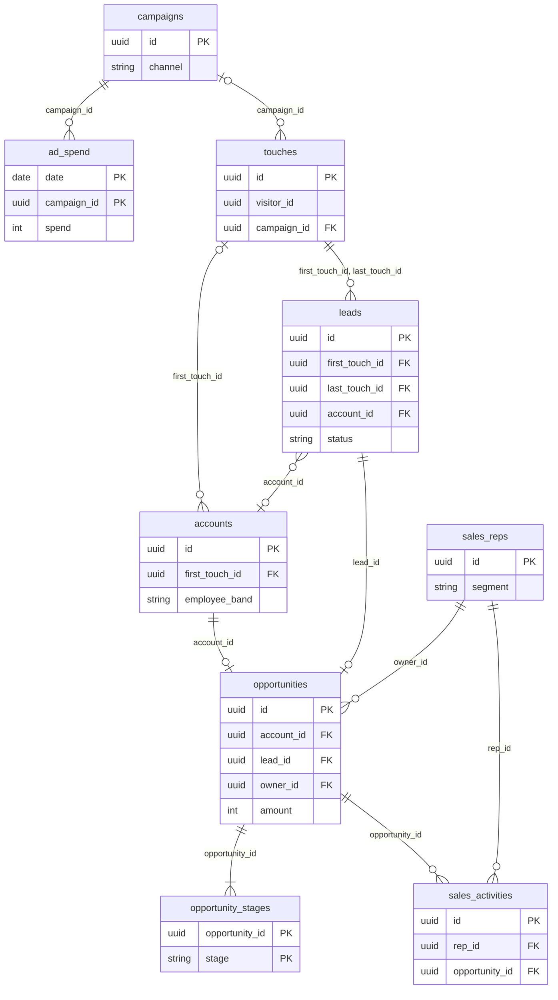
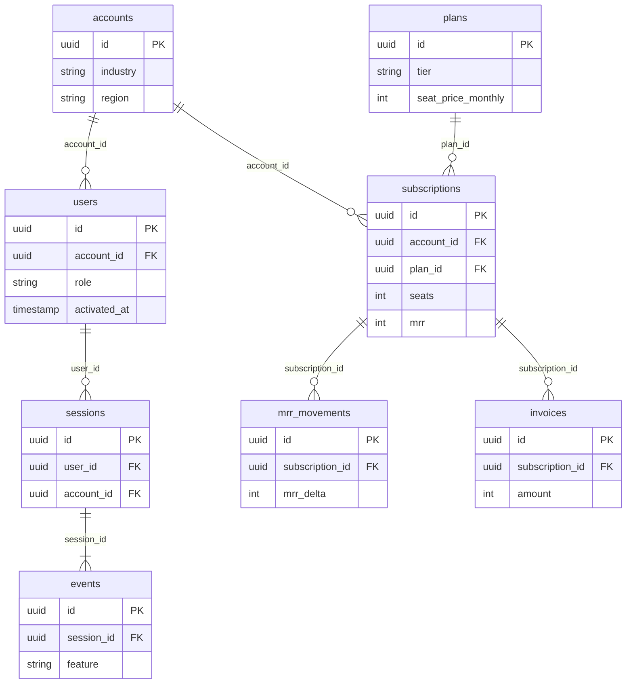

# SaaS scenario

`--scenario saas` simulates a B2B software company selling seat-based subscriptions. Paid and organic marketing bring anonymous visitors; some become leads, and leads become accounts through a self-serve trial or a sales-led opportunity. Accounts add and lose users, pay monthly or annual invoices, churn and reactivate, and use the product in sessions full of feature events. Code lives in [`src/scenario/saas/`](../../src/scenario/saas/).

```bash
rowing-machine --scenario saas --seed 42 --years 4 --scale 100
rowing-machine --scenario saas --seed 42 --scale 100 --target-rows 1000 --format parquet
```

## Entities

The sixteen entities split at `accounts`: go-to-market tables explain how an account arrived, and product tables explain what it paid and did. [The output schema](../output-schema.md#campaigns) lists every column.





`sessions`, `events`, `mrr_movements`, and `invoices` also carry `account_id` (and events `user_id`) so queries can skip a join. `visitor_id` groups a visitor's touches and lead; it has no table of its own.

## Volume

A default run (`--seed 42`, four years, `--scale 100`) writes:

| Entity | Rows | Entity | Rows |
| --- | --- | --- | --- |
| `campaigns` | 51 | `plans` | 3 |
| `ad_spend` | 4,380 | `users` | 24,278 |
| `touches` | 228,469 | `subscriptions` | 13,380 |
| `leads` | 10,292 | `mrr_movements` | 14,657 |
| `accounts` | 3,014 | `invoices` | 21,726 |
| `sales_reps` | 6 | `sessions` | 4,063,579 |
| `opportunities` | 1,169 | `events` | 32,403,297 |
| `opportunity_stages` | 5,677 | | |
| `sales_activities` | 18,994 | | |

`--scale` sets daily visitors: `scale × weight / 100` per channel, with weights 25 (`paid_search`), 20 (`paid_social`), 10 (`display`), 20 (`content`), 10 (`referral`), and 15 (`direct`), so the default is 100 a day. Accounts follow visitors through the funnel; sessions and events follow active user-days, so they dominate the row count. `--target-rows` calibrates on accounts, within 5% or to the nearest whole day, and fails with a suggestion when the calendar cannot reach the target.

## Marketing and leads

Paid search, paid social, and display campaigns run in consecutive 90-day flights, one campaign per channel per flight. Each paid channel's daily clicks vary ±10% around its base, with exactly one touch per click; impressions are 20, 40, or 80 per click and cost per click is 600, 250, or 100 cents. Content, referral, and direct visitors arrive without spend, and their daily volume grows toward twice its starting level (`base × day / (day + 1460)` extra).

About 40% of visitors have a second touch on the same day, through a different channel. Leads keep both first and last touch IDs; their `lead_source`, and the `acquisition_channel` of any resulting account, follow the first touch.

| First-touch channel | Visit-to-lead probability | Lead progression probability |
| --- | --- | --- |
| `paid_search` | 8% | 40% |
| `paid_social` | 4% | 20% |
| `display` | 2% | 12% |
| `content` | 7% | 35% |
| `referral` | 10% | 55% |
| `direct` | 5% | 30% |

Leads that do not progress stay `qualified`. Each account draws an employee band (`small`, `medium`, `large`) with equal odds; among progressing leads, the demo probability is 10%, 50%, or 90% by band. Demo requests enter the sales pipeline when a rep has capacity; otherwise they stay `demo_requested` without an account. The other progressing leads become `converted`, link to an account, and start its self-serve trial the next day. A trial that would begin after the run leaves the lead `qualified` without an account.

## Sales pipeline

Sales prospects get an account and opportunity the day after lead creation. Reps own one employee-band segment, with annual costs of 9,000,000, 12,000,000, or 16,000,000 cents for small, medium, or large accounts. There is one rep per segment for every 100 of `--scale`, rounded up. Runs longer than 640 days hire replacements on day 640; runs longer than 730 days end the first reps' employment on day 730.

Rep capacity ramps over the first 90 days toward 20, 30, or 40 concurrent opportunities by segment. Assignment picks the least-loaded eligible rep, who must stay employed through the planned close. Unassigned requests have no opportunity rows.

Opportunities move through discovery, demo, proposal, negotiation, and a won or lost close. Base cycles span 21–41, 45–74, or 90–134 days by segment. Deals that would close within 30 days of a quarter end have a 70% chance of slipping toward its final two weeks. Each admitted deal wins with probability 38%. Activities occur every 3–7 days while the deal is open, including its close day.

`amount` is quoted annual recurring revenue: twelve times the account's initial MRR. An observed win converts its lead and starts a paid subscription on the close date, skipping the trial. Open and lost opportunities keep `demo_requested` leads and have no subscription. Stage and activity rows stop at the exclusive run boundary; closes beyond it stay null.

## Trials, membership, and churn

Each account draws a plan tier (its band's tier 70% of the time, otherwise any tier), monthly or annual billing (25% annual), and a fixed latent engagement score from 0.25 to 0.95. Accounts begin with 2, 5, or 12 users by band, each with a random role. Users activate within seven days of creation with a chance tied to engagement. A 14-day trial converts with probability `0.15 + 0.75 × activated share`. Accounts still in trial, or whose trial did not convert, have users but no subscription.

Paid accounts add a user each day with probability 0.8%, 1.8%, or 4% by band, up to 60 users including departed ones; otherwise an active member departs with probability 0.6% when more than one remains. Billable seats equal active membership, so additions and departures cause expansion and contraction. `users` keeps departed users and does not record departures.

The daily churn hazard is `(0.012 × e^(−tenure / 60) + 0.0005) × (1.6 − engagement)`, with tenure in days from trial arrival (self-serve) or the won close (sales). That gives steep early cohort loss and flatter mature retention. A churned account can reactivate after 45 days if no invoice is past its grace period. Engagement is internal and not written out.

## Subscriptions and invoices

| Plan index | Monthly seat price | Annual seat price | Annual price as MRR | `included_seats` |
| --- | --- | --- | --- | --- |
| 0 | 1,500 | 15,000 | 1,250 | 1 |
| 1 | 3,000 | 30,000 | 2,500 | 5 |
| 2 | 6,000 | 60,000 | 5,000 | 10 |

Prices are cents per seat. `included_seats` is reference metadata; every seat counts toward MRR. An account's plan and billing interval never change.

Subscriptions are immutable paid intervals, `[started_at, ended_at)`. A membership change closes the current row and opens another at the same timestamp with the new seats and MRR; an open interval has null `ended_at`. The first positive MRR is `new`, changes above zero are `expansion` or `contraction`, a move to zero is `churn`, and a positive return is `reactivation`. Summing `mrr_delta` through a timestamp equals both the latest `mrr_after` and the active subscription MRR.

Invoices start at the subscription boundary and renew in calendar months or years. Each period ends at its next renewal, the subscription end, or the run boundary, whichever is first, and never crosses a subscription boundary. Partial periods are prorated by covered days with integer arithmetic. A January 31 renewal clamps to February's last day, and later cycles start there.

Most invoices are paid on issue. About 13% are paid 8–20 days late and 2% are never paid. An account with an invoice unpaid after 30 days churns on day 31, even when that invoice belongs to an ended seat interval. Payments after the run boundary appear as null. Ended subscriptions are `canceled`; an open one is `past_due` while any account invoice is unpaid and `active` otherwise. Trials have no subscription rows.

## Product usage

Regular sessions start between 09:00 and 16:59 in the account's regional time and last 5–55 minutes, capped at the run boundary. Regions use fixed UTC offsets of −5, +1, +9, and −3 hours by label index, with no daylight saving time. Sessions are desktop 85% of the time and mobile otherwise.

Daily session frequency combines account engagement with a personal multiplier from 0.7 to 1.3 and an onboarding multiplier of `1 + e^(−days_since_user_creation / 14)`. Weekends run at 8% of weekday frequency, and December 24 through January 1 applies a further 20% multiplier. Frequency fades linearly over the 28 days before a churn. Sessions stop at trial nonconversion or churn, resume on reactivation, and stop for good when the user departs.

Every non-null `users.activated_at` has exactly one `<feature>:activated` event at that midnight UTC timestamp, inside its own one-minute desktop session outside business hours. Activation uses feature index 0. Regular sessions hold 4–12 `<feature>:used` events within `[started_at, ended_at)`, drawn from the theme's first 16 feature names with weights that depend on plan tier and user role.

## Parameters

SaaS declares no parameters, so `[params.saas]` and `--param` have nothing to set.

## Theme slots

| Slot | Shape | Used for |
| --- | --- | --- |
| `names.person` | Generator | Lead, rep, and user names; user emails |
| `names.organization` | Generator | Account names; user email domains |
| `names.plan` | Generator | Three plan names, assigned by seed, so a name need not match its tier |
| `names.feature` | Generator | The first 16 assigned names become event features |
| `names.campaign` | Generator | Campaign names, three per 90-day flight |
| `labels.industries` | 6 values | Account industries |
| `labels.roles` | 3 values | User roles |
| `labels.regions` | 4 values | Account regions, which also set the session time zone |
| `labels.plan_tiers` | 3 values | Plan tiers, lowest to highest |

User emails combine person and organization slugs under the reserved `.example` domain. Billing intervals, employee bands, channels, stages, movement types, and statuses are scenario values that no theme changes.

[`plain`](../themes/plain.md#saas) is the only bundled SaaS theme; its page lists the values it supplies.

## Example queries

These use DuckDB SQL after loading the files as tables named for their entities.

### Attribution and paid CAC

Compare first-touch and last-touch channels for identified leads:

```sql
select
    first_touch.channel as first_touch_channel,
    last_touch.channel as last_touch_channel,
    count(*) as leads,
    count(l.account_id) as linked_accounts
from leads as l
join touches as first_touch on first_touch.id = l.first_touch_id
join touches as last_touch on last_touch.id = l.last_touch_id
group by 1, 2
order by 1, 2;
```

Paid CAC divides monthly channel spend by accounts that first became paying customers in that month, attributed to their first touch. A trial signup is not yet a paying customer. A month without paying acquisitions has null CAC; values are cents per account.

```sql
with spend as (
    select
        date_trunc('month', cast(s.date as date)) as month,
        c.channel,
        sum(s.spend) as spend_cents
    from ad_spend as s
    join campaigns as c on c.id = s.campaign_id
    group by 1, 2
), first_payment as (
    select account_id, min(started_at) as first_paid_at
    from subscriptions
    group by 1
), acquisitions as (
    select
        date_trunc('month', p.first_paid_at) as month,
        a.acquisition_channel as channel,
        count(distinct a.id) as paying_accounts
    from first_payment as p
    join accounts as a on a.id = p.account_id
    group by 1, 2
)
select
    s.month,
    s.channel,
    s.spend_cents,
    coalesce(a.paying_accounts, 0) as paying_accounts,
    s.spend_cents / nullif(a.paying_accounts, 0)::double as paid_cac_cents
from spend as s
left join acquisitions as a using (month, channel)
order by 1, 2;
```

### Pipeline and win rate

Pipeline at the run boundary uses each opportunity's latest observed stage:

```sql
select stage, count(*) as opportunities, sum(amount) as pipeline_arr_cents
from opportunities
where closed_at is null
group by 1
order by 1;
```

Win rate uses closed deals only, grouped by close month and rep segment:

```sql
select
    date_trunc('month', o.closed_at) as month,
    r.segment,
    count(*) as closed_deals,
    count(*) filter (where o.outcome = 'won') / count(*)::double as win_rate
from opportunities as o
join sales_reps as r on r.id = o.owner_id
where o.closed_at is not null
group by 1, 2
order by 1, 2;
```

### Blended CAC and payback

Blended CAC includes ad spend and rep compensation across self-serve and sales acquisitions. Compensation accrues on employed days at `annual_cost / 365`; this example clips employment to the run and each month. Replace the run bounds with the actual exclusive interval. Acquisitions count each account once, using its first subscription and initial MRR. Seat changes and reactivations do not add acquisitions. Payback is acquisition cost divided by initial MRR, in months, before gross-margin adjustment; it is not a cash-recovery forecast. Months without acquisitions have null CAC and payback.

```sql
with bounds as (
    select date '2023-01-01' as run_start, date '2026-12-31' as run_end
), months as (
    select cast(m as date) as month, b.run_start, b.run_end
    from bounds as b,
        generate_series(date_trunc('month', b.run_start),
            b.run_end - interval '1 day', interval '1 month') as series(m)
), compensation as (
    select
        m.month,
        coalesce(sum(
            greatest(0, date_diff('day',
                greatest(m.month, m.run_start, cast(r.hired_at as date)),
                least(cast(m.month + interval '1 month' as date), m.run_end,
                    coalesce(cast(r.departed_at as date), m.run_end))))
            * r.annual_cost / 365.0
        ), 0) as rep_cost_cents
    from months as m
    left join sales_reps as r on true
    group by 1
), spend as (
    select date_trunc('month', cast(date as date)) as month,
        sum(spend) as spend_cents
    from ad_spend
    group by 1
), first_paid as (
    select account_id, started_at, mrr
    from subscriptions
    qualify row_number() over (partition by account_id order by started_at, id) = 1
), acquisitions as (
    select date_trunc('month', started_at) as month,
        count(*) as paying_accounts, sum(mrr) as initial_mrr_cents
    from first_paid
    group by 1
), monthly as (
    select c.month,
        c.rep_cost_cents + coalesce(s.spend_cents, 0) as acquisition_cost_cents,
        coalesce(a.paying_accounts, 0) as paying_accounts,
        coalesce(a.initial_mrr_cents, 0) as initial_mrr_cents
    from compensation as c
    left join spend as s using (month)
    left join acquisitions as a using (month)
)
select *,
    acquisition_cost_cents / nullif(paying_accounts, 0) as blended_cac_cents,
    acquisition_cost_cents / nullif(initial_mrr_cents, 0) as payback_months
from monthly
order by month;
```

### Weekly engagement

This DuckDB query counts regular activity by UTC week, excluding activation markers. It reports only weeks with activity; add a calendar table when zero-activity weeks matter.

```sql
select
    date_trunc('week', occurred_at) as week,
    count(distinct account_id) as active_accounts,
    count(distinct user_id) as active_users,
    count(distinct session_id) as sessions,
    count(*) as feature_uses
from events
where event_name = feature || ':used'
group by 1
order by 1;
```

Compare feature adoption across roles without depending on a theme's specific vocabulary:

```sql
select
    u.role,
    e.feature,
    count(distinct e.user_id) as users,
    count(*) as feature_uses
from events as e
join users as u on u.id = e.user_id
where e.event_name = e.feature || ':used'
group by 1, 2
order by 1, 3 desc, 2;
```

### MRR and ARR at a date

A date means midnight UTC; intervals ending at that timestamp do not contribute.

```sql
select
    coalesce(sum(mrr), 0) as mrr_cents,
    coalesce(sum(mrr), 0) * 12 as arr_cents
from subscriptions
where started_at <= timestamp '2025-01-01 00:00:00'
    and (ended_at is null or ended_at > timestamp '2025-01-01 00:00:00');
```

The ledger provides an independent calculation:

```sql
select coalesce(sum(mrr_delta), 0) as mrr_cents
from mrr_movements
where occurred_at <= timestamp '2025-01-01 00:00:00';
```

Monthly movement totals explain changes in revenue:

```sql
select
    date_trunc('month', occurred_at) as month,
    movement_type,
    sum(mrr_delta) as mrr_change_cents
from mrr_movements
group by 1, 2
order by 1, 2;
```

### Signup-cohort retention

This query measures the fraction of self-serve signups with a paid subscription at each monthly age. It excludes sales prospects, includes trial nonconversion in the denominator, and excludes observations past the dataset boundary. Revenue cohorts instead begin at each account's first paid subscription, include sales wins, and exclude nonpaying accounts. Set the observation cutoff to the exclusive end of the run; the default four-year run starts January 1, 2023 and ends December 31, 2026.

```sql
with observations as (
    select
        a.id as account_id,
        date_trunc('month', a.created_at) as cohort,
        age.month_age,
        a.created_at + age.month_age * interval '1 month' as observed_at
    from accounts as a
    cross join generate_series(1, 24) as age(month_age)
    where not exists (
        select 1 from opportunities as o where o.account_id = a.id
    )
), eligible as (
    select *
    from observations
    where observed_at < timestamp '2026-12-31 00:00:00'
)
select
    e.cohort,
    e.month_age,
    count(distinct case when s.id is not null then e.account_id end)
        / count(distinct e.account_id)::double as paid_retention
from eligible as e
left join subscriptions as s
    on s.account_id = e.account_id
    and s.started_at <= e.observed_at
    and (s.ended_at is null or s.ended_at > e.observed_at)
group by 1, 2
order by 1, 2;
```
