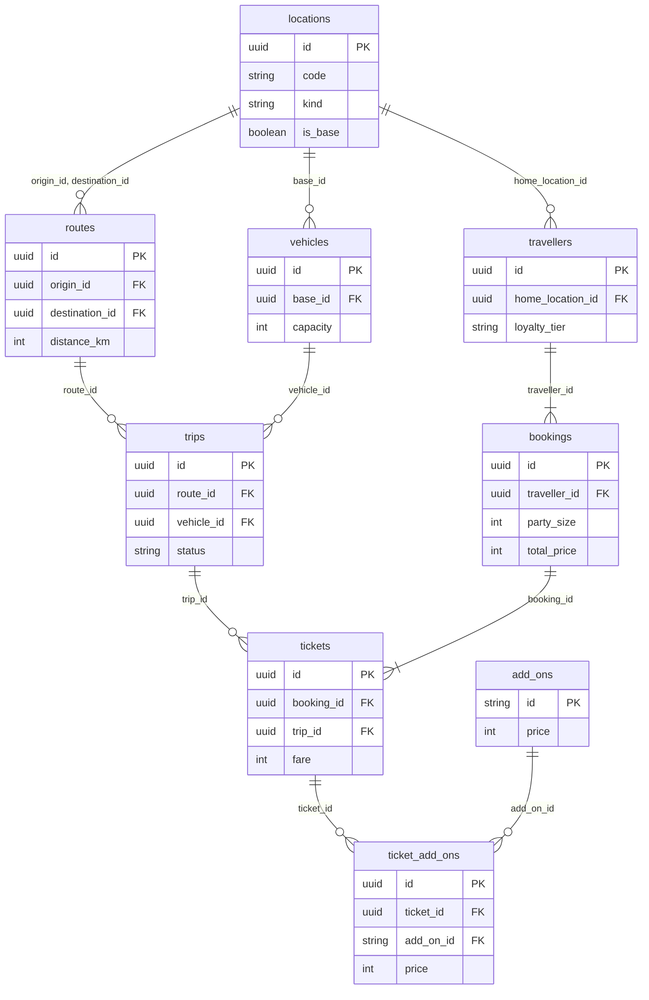

# Travel scenario

`--scenario travel` simulates a transport network that people pay to ride. The theme's catalogs supply locations, vehicle types, fares, and extras; the scenario links bases to destinations, sizes each base's fleet, flies a seasonal schedule with delays and cancellations, and sells seats to each base's traveller pool. The bundled `airline` theme renders it as SuperAir, a low-cost airline. Code lives in [`src/scenario/travel/`](../../src/scenario/travel/).

## Entities



Every ticket in a booking is on the same trip, so a booking is one party on one one-way trip. [The output schema](../output-schema.md#locations) lists every column under the generic names.

## Volume

A default `airline` run (four years, `--scale 100`) writes:

| Entity | `--seed 42` | `--seed 7` |
| --- | --- | --- |
| `locations` | 43 | 43 |
| `routes` | 36 | 32 |
| `vehicles` | 18 | 19 |
| `add_ons` | 10 | 10 |
| `trips` | 67,024 | 57,980 |
| `bookings` | 5,912,646 | 5,412,130 |
| `tickets` | 10,779,319 | 9,867,281 |
| `ticket_add_ons` | 10,564,462 | 9,667,081 |
| `travellers` | 179,666 | 179,883 |

The seed picks which destinations each base serves, so volume varies more by seed here than in other scenarios. Trips scale with `route_density`, `daily_frequency`, and the number of bases; tickets scale with trips, vehicle capacity, and `load_factor`. `--scale` only sizes the traveller pools, so it changes how often each traveller books, not how many seats sell. `--target-rows` calibrates on tickets.

## Network

The network is built once per run and stays fixed (`tr-R001`).

- **Locations** come from `catalogs.locations`. Bases (`base = true`) station vehicles; `kind` is `city`, `beach`, or `ski` and picks the seasonal curve; `weight` scales popularity and frequency.
- **Services** link a base to each location 200 km to `max_route_km` away with probability `route_density × weight`, capped at 1. A base with no chosen service gets its nearest location in range. A pair of bases is considered once, from the earlier base in catalog order.
- **Routes** are a service's two directions. Duration is `taxi_minutes + distance / cruise_kmh`, rounded to 5 minutes; distance is great-circle.
- **Fleets** hold enough vehicles to fly the base's busiest month within the departure window, plus one spare. Vehicle types come from `catalogs.vehicle_types` by `share`; names come from the `vehicle` name kind.

Each work unit is one base-day: the base's vehicles fly that day's schedule and sell its seats. All timestamps are UTC.

## Schedule

A service flies `max(round(daily_frequency × weight), 1)` rotations a day at its peak. In a given month it flies `floor(frequency × min(season, 1.15) + 0.35)` rotations, so a beach route with one daily rotation pauses from November to February and a ski route pauses from April to October.

| Kind | Jan | Feb | Mar | Apr | May | Jun | Jul | Aug | Sep | Oct | Nov | Dec |
| --- | --- | --- | --- | --- | --- | --- | --- | --- | --- | --- | --- | --- |
| city | 0.85 | 0.85 | 0.95 | 1.0 | 1.0 | 1.05 | 1.1 | 1.1 | 1.0 | 1.0 | 0.9 | 1.0 |
| beach | 0.55 | 0.6 | 0.75 | 0.95 | 1.1 | 1.25 | 1.35 | 1.35 | 1.15 | 0.9 | 0.6 | 0.65 |
| ski | 1.3 | 1.35 | 1.1 | 0.8 | 0.5 | 0.5 | 0.55 | 0.55 | 0.5 | 0.6 | 0.8 | 1.25 |

Rotations spread evenly between `first_departure` and `last_departure`, shifted by a fixed per-service offset of up to an hour either way, so a route keeps the same departure times day to day. Each rotation goes to the vehicle that frees up first; departures round up to 5 minutes, and the return leg leaves one turnaround after the outbound arrives. A trip code is the theme's `trip_prefix` plus `1000 + service × 48 + rotation × 2`, plus 1 for the inbound leg, so inbound codes are odd.

## Operations

- A rotation is cancelled with probability `cancellation_rate`, times 1.8 in winter (December 21 – March 20). Both legs are cancelled, they have null departure and arrival times, and every ticket on them is `refunded`.
- Each departure leaves at the later of its schedule and the vehicle's previous arrival plus `turnaround_minutes`, plus its own delay: with probability `delay_rate` an exponential delay with mean `delay_minutes`, otherwise 0–5 minutes. Delays carry into the vehicle's later trips.
- Flying time varies by a normal ±6 minutes and is never under 85% of the scheduled duration.

## Demand and fares

Load factor is `load_factor × (season × weekday × growth)^0.6`, times a normal ±6% draw, clamped to 0.15–1.0. Growth compounds `annual_growth` yearly from the first day.

| Mon | Tue | Wed | Thu | Fri | Sat | Sun |
| --- | --- | --- | --- | --- | --- | --- |
| 1.0 | 0.86 | 0.9 | 1.02 | 1.16 | 0.97 | 1.12 |

Seats sold follow a normal approximation of the binomial, capped at capacity, and each sold seat is distinct; seats are a row number and a letter A–F. Seats sell in parties of 1–4 (46%, 34%, 11%, 9%). Each party is one booking by a traveller from the base's pool of `travellers_per_base × --scale`, drawn with a squared uniform so a minority books often. Lead time is exponential with mean `lead_time_days` (1.3× for parties above two), capped at 330 days, and a booking is at least 45 minutes before departure. Channel and fare class come from their catalogs by `share`.

Each ticket's fare, in cents:

```text
fare = (fare_base + fare_per_km × km)
     × (0.72 + 0.95 × e^(−lead_days / 18))
     × (0.75 + 0.45 × load)
     × fare_class.multiplier
     × max(normal(1, 0.07), 0.6)
```

It is rounded to whole hundreds of cents minus one (4,599 for £45.99), with a 999-cent floor. Each ticket independently buys each add-on with its `attach_rate`, at its catalog price. A ticket on a flown trip is `no_show` with probability `no_show_rate`, otherwise `flown`. `bookings.total_price` is the tickets' fares plus their add-ons.

Loyalty tiers split travellers who booked into four cohorts by booking count, sizes differing by at most one, with traveller UUID breaking ties. Only travellers with a booking are written, each with their base as home.

## Parameters

Set these under `[params.travel]` in a theme or with `--param name=value`. `airline` uses every default. Parameters that shape schedules or demand leave locations and routes unchanged (`tr-R030`).

| Parameter | Default | Range | Meaning |
| --- | --- | --- | --- |
| `daily_frequency` | 1.0 | 0.1–24.0 | Rotations per route per day for a weight-1 destination |
| `route_density` | 0.07 | 0.0–1.0 | Chance each base serves a weight-1 location in range |
| `max_route_km` | 3800.0 | 250.0–20,000.0 | Longest route a base flies |
| `load_factor` | 0.84 | 0.05–1.0 | Average share of seats sold |
| `annual_growth` | 0.05 | -0.5–1.0 | Yearly demand growth |
| `lead_time_days` | 38.0 | 1.0–300.0 | Mean days between booking and departure |
| `fare_base` | 1900.0 | 0.0–1,000,000.0 | Base fare in cents before distance |
| `fare_per_km` | 2.4 | 0.0–1000.0 | Fare cents per kilometre |
| `cancellation_rate` | 0.012 | 0.0–0.5 | Share of rotations cancelled |
| `delay_rate` | 0.32 | 0.0–1.0 | Share of departures with their own delay |
| `delay_minutes` | 24.0 | 1.0–600.0 | Mean length of a departure's own delay |
| `no_show_rate` | 0.03 | 0.0–0.5 | Share of ticketed travellers who never board |
| `turnaround_minutes` | 30.0 | 5.0–600.0 | Minimum time between a vehicle's arrival and next departure |
| `cruise_kmh` | 760.0 | 10.0–1200.0 | Average speed between taxiing |
| `taxi_minutes` | 22.0 | 0.0–120.0 | Minutes added to every trip's duration |
| `first_departure` | 360.0 | 0.0–1439.0 | Earliest scheduled departure, minutes after midnight |
| `last_departure` | 1290.0 | 0.0–1439.0 | Latest preferred departure, minutes after midnight |
| `travellers_per_base` | 300.0 | 1.0–100,000.0 | Traveller pool per base, times `--scale` |

## Theme slots

| Slot | Shape | Meaning |
| --- | --- | --- |
| `names.person` | Generator | Traveller names |
| `names.vehicle` | Generator | Vehicle names, such as registrations |
| `labels.ranks` | 4 values | Loyalty tiers from least to most frequent |
| `labels.trip_prefix` | 1 value | Prefix for trip codes |
| `catalogs.locations` | `name`, `code`, `latitude`, `longitude`, `base`, `kind`, `weight`; at least 2 | Places the network links |
| `catalogs.vehicle_types` | `name`, `capacity`, `share`; at least 1 | Fleet mix; capacity is whole seats |
| `catalogs.add_ons` | `name`, `category`, `price`, `attach_rate`; at least 1 | Extras bought per ticket; price in whole cents, attach rate 0–1 |
| `catalogs.fare_classes` | `name`, `multiplier`, `share`; at least 1 | Fare bundles; the multiplier applies to the fare |
| `catalogs.channels` | `name`, `share`; at least 1 | Where bookings are made |

Location codes must be unique, at least one location must be a base, `weight` and every `share` must be positive, vehicle capacities must be positive whole numbers, and coordinates must be on the globe. Add-on IDs are `AO-001` onward in catalog order.

### `airline` values

| Slot | `airline` |
| --- | --- |
| Locations | 43 airports: 6 UK bases (LGW, LTN, BRS, MAN, EDI, BFS), 15 more city airports, 17 beach, 5 ski; weights 0.4–2.5 |
| Vehicle types | Airbus A319 (156 seats, 10%), A320 (186, 30%), A320neo (186, 35%), A321neo (235, 25%) |
| Add-ons | 10 in categories bags, seats, boarding, onboard, and flexibility, 800–4,800 cents |
| Fare classes | Saver (×1.0, 84%), Plus (×1.45, 11%), Flex (×1.9, 5%) |
| Channels | app (55%), web (38%), travel partner (7%) |
| `ranks` | occasional, regular, frequent, superflyer |
| `trip_prefix` | SA |
| Vehicle names | `G-SA` plus two letters (676 combinations) |

### `airline` renames

| Generic | `airline` |
| --- | --- |
| `locations` | `airports` |
| `vehicles` | `aircraft` |
| `trips` | `flights` |
| `travellers` | `passengers` |
| `vehicles.name` | `registration` |
| `vehicles.base_id` | `base_airport_id` |
| `trips.code` | `flight_number` |
| `trips.vehicle_id` | `aircraft_id` |
| `trips.capacity` | `seats` |
| `tickets.trip_id` | `flight_id` |
| `bookings.traveller_id` | `passenger_id` |
| `travellers.home_location_id` | `home_airport_id` |
| `routes.origin_id` | `origin_airport_id` |
| `routes.destination_id` | `destination_airport_id` |
